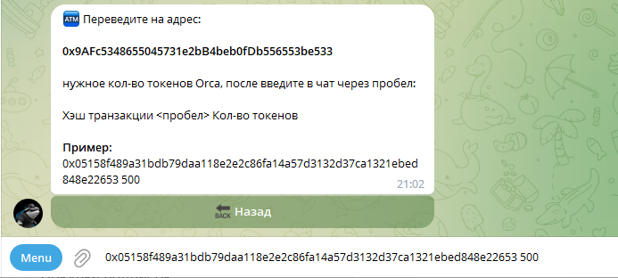

# 📥 Пополнение кошелька

## Взаимодействие

Для пополнения кошелька токенами ORCA необходимо:

* Перевести нужное количество токенов на кошелёк **0x9AFc5348655045731e2bB4beb0fDb556553be533** в сети BSC
* Начиная с главного меню перейти по пути, нажимая на кнопки: "Личный кабинет" -> "Мой кошелёк" -> "Пополнить баланс"
* Получить Transaction Hash и отправить чат-боту следующий текст: Хэш транзакции <пробел> Кол-во токенов. Пример указан на изображении ниже.
* Пополнение баланса токенов происходит в ручном режиме. Как только администратор проверит Вашу заявку, токены будут зачислены на Ваш баланс.

<figure><figcaption>
Пример ввода
</figcaption></figure>

Если у Вас нет токенов ORCA, то их можно приобрести через PancakeSwap. Более подробную инструкцию смотрите ниже.


[buy\_tokens.md](buy\_tokens.md)

