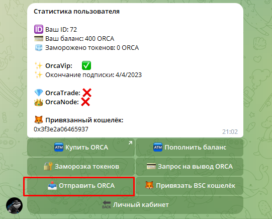
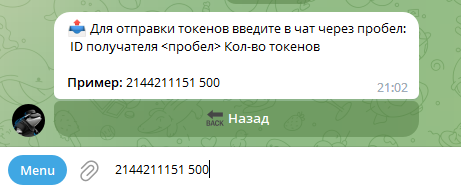

# 📤 Отправка токенов

## Взаимодействие

Отправка токенов ORCA подразумевает перевод между двумя кошельками пользователей чат-бота. Для совершения данной операции необходимо знать ID пользователя.


ID пользователя можно посмотреть во вкладке "Мой кошелёк"


Для совершения операции необходимо:

* Нажать на кнопку "Отправить ORCA"

<figure><figcaption>
Изображение кнопки отправки Orca
</figcaption></figure>

* Указать ID получателя и количество переводимых токенов через пробел. Пример показан на изображении ниже.

<figure><figcaption>
Пример ввода ID и кол-ва токенов для отправки
</figcaption></figure>
