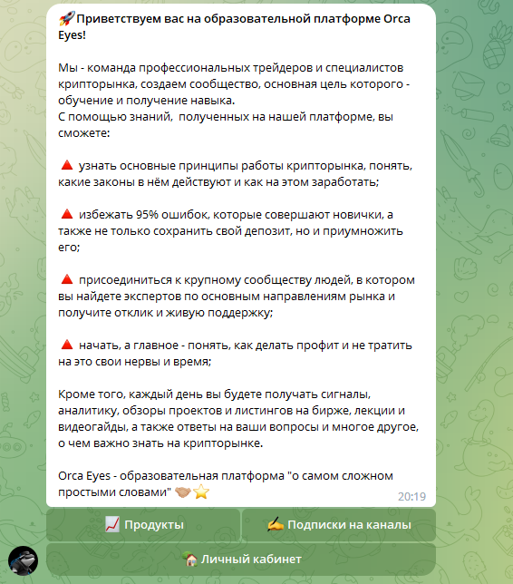
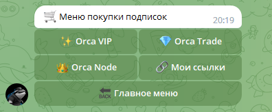
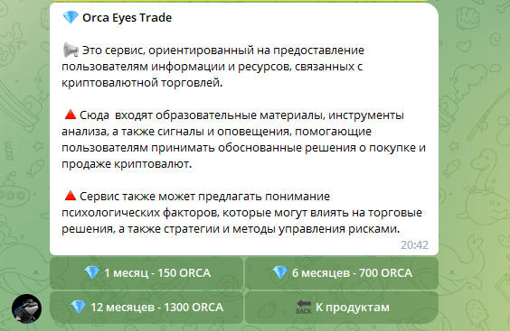

# 🛒 Покупка подписок

## Взаимодействие

Для покупки подписок необходимо выполнить следующие действия:

* Начиная с главной страницы перейти по пути: "Продукты"

<figure><figcaption>
Главное меню
</figcaption></figure>

* Выбрать нужную подписку (Vip, Trade, Node)

<figure><figcaption>
Меню покупок
</figcaption></figure>

* Выбрать нужный тарифный план

<figure><figcaption>
Меню покупки тарифного плана
</figcaption></figure>

При нажатии на кнопку покупки с Вашего баланса будет автоматически списано определённое количество токенов за покупку, указанное на самой кнопке, и после выдан доступ в соответствующий закрытый чат.

## Продукты

Более подробно о продуктах экосистемы OrcaEyes Вы можете прочесть во вкладке Products.


[Broken link](broken-reference)

