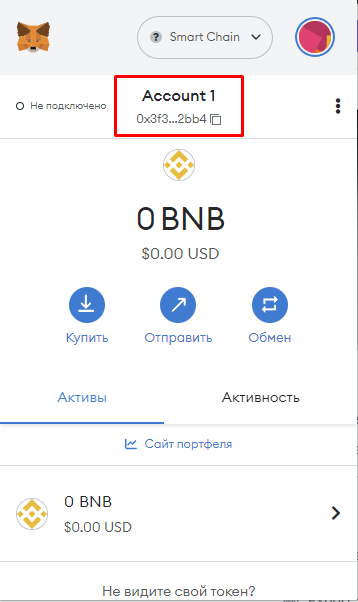

# 🦊 Привязка кошелька

## Взаимодействие

Для того, чтобы привязать свой BSC кошелёк к чат-боту OrcaEyes необходимо выполнить следующие действия:

* Начиная с главного меню перейти по пути: "Личный кабинет" -> "Мой кошелёк" -> "Привязать BSC кошелёк"
* Далее отправить в личные сообщения боту адрес Вашего кошелька в сети BSC.
* Готово! Бот OrcaEyes успешно запомнил Ваш кошелёк!

## Где найти адрес кошелька

Следующий пример будет приведён для кошелька MetaMask.


MetaMask для браузера Chrome: [ссылка](https://chrome.google.com/webstore/detail/metamask/nkbihfbeogaeaoehlefnkodbefgpgknn?hl=ru)


Если кошелёк MetaMask не установлен, то следует установить его как расширение для браузера Google Chrome и следовать предлагаемым шагам для получения своего кошелька.

&#x20;После получения доступа к кошельку, свой адрес Вы сможете найти в верхней части расширения MetaMask. После нажатия адрес автоматически скопируется в Ваш буфер обмена.&#x20;

<figure><figcaption></figcaption></figure>
