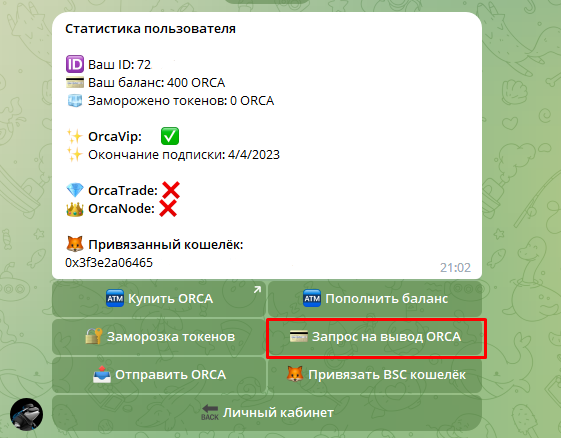
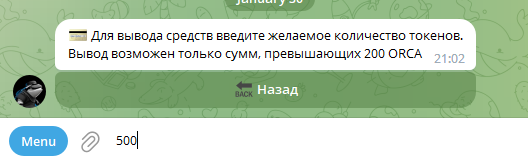
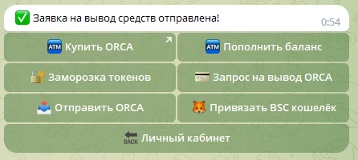

# 📤 Вывод токенов

## Взаимодействие


Для вывода токенов ORCA необходимо привязать кошелёк BSC


Для совершения данной операции необходимо в меню "Мой кошелёк" нажать на кнопку "Запрос на вывод ORCA". И после ввести необходимое количество токенов для вывода.

<figure><figcaption>
Изображение кнопки запроса на вывод
</figcaption></figure>


Вывод токенов ORCA доступен для сумм превышающих 200 монет.


На данном этапе необходимо ввести одно число - желаемое количество монет для вывода

<figure><figcaption>
Изображение с вводом кол-ва монет для вывода
</figcaption></figure>

Если всё было выполнено правильно, то Вы увидите следующий текст:

<figure><figcaption>
Изображение с успешным выводом средств
</figcaption></figure>

Вывод средств осуществляется в ручном режиме. Как только администратор подтвердит заявку, токены будут перечислены на Ваш BSC кошелёк, привязанный в меню "Мой кошелёк"
