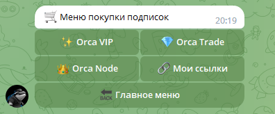

# 📜 Описание кнопок

## Введение

Взаимодействие с чат-ботом происходит через нажатия на inline кнопок, расположенных под стартовым сообщением.

<figure><figcaption></figcaption></figure>

Любое нажатие кнопки приводит к изменению текста меню и самих кнопок меню в сообщении.

## Products Button / Кнопка Продукты

Данный пункт меню отвечает за отображение и возможную дальнейшую покупку привилегий в экосистеме Orca.

<figure><figcaption></figcaption></figure>

При нажатии на любой из продуктов будет отображено меню покупки выбранной привилегии.

<figure><figcaption></figcaption></figure>

При нажатии на кнопку покупки с Вашего баланса будет автоматически списано определённое количество токенов за покупку, указанное на самой кнопке, и после выдан доступ в соответствующий закрытый чат.
