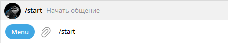

# 💡 Начало

## Способы начала приватного чата с ботом

Перед началом работы с чат-ботом OrcaEyes необходима регистрация в системе, которая производится автоматически при отправке команды.&#x20;

Далее описаны способы начала приватного чата с ботом.

### Через реферальную ссылку


Реферальную ссылку можно получить от пользователя, который уже зарегистрирован в чат-боте OrcaEyes.&#x20;

Вид ссылки: [https://t.me/OrcaEyesbot?start=922010539](https://t.me/OrcaEyesbot?start=922010539)


При регистрации в чат-боте через реферальную ссылку команды вводить не нужно. Весь процесс автоматизирован.

### Через прямую ссылку


Данный способ актуален, если нет реферальной ссылки.

Прямая ссылка: [https://t.me/OrcaEyesbot?start](https://t.me/OrcaEyesbot?start=922010539)


При регистрации в чат-боте через прямую ссылку команды вводить не нужно. Весь процесс автоматизирован.

### Возникающие ошибки


Обычно любые ошибки возникают из-за неправильного ввода пользователя.


Если после перехода по реферальной или прямой ссылке, чат-бот не отправил стартового сообщения, то в контекстном меню бота выберите команду /start, либо пропишите /start в приватный чат с ботом и отправьте сообщение.&#x20;

<figure><figcaption></figcaption></figure>
